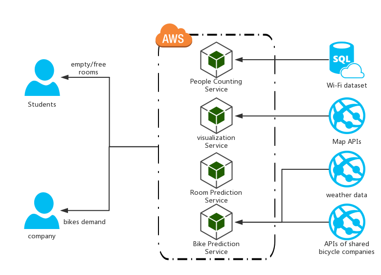

# Platform & Services
## Data sources
* sensors (weather data)
* stream data platforms (APIs of shared bicycle companies)
* our own database-as-a-service (Wi-Fi dataset)

## Analytics
* data visualization
* machine learning and other methods to predict:
  * which rooms are suitable for students
  * how many bikes the shared bicycles companies should put on the street near teaching buildings

## Data Services
* APIs: for some shared bicycle companies, they can visit our APIs and get Wi-Fi and weather data and then they can decide put more bicycles around the teaching buildings or not.

## Notification
* web alert to students about which rooms are suitable for self-study.
* send emails to shared bicycle companies (who subscribes) about the data updating.

## Human Services
* for **shared bicycle companies**: APIs
* for **students**: they can know the number of people in the teaching buildings, so that they can decide which teaching building should they go and self-study here.
* for **building administrators**: how many rooms should be open to students

## Elasticity Management
* Data Missing: machine learning or econometrics (*e.g.* time series) methods to stimulate them
* API errors: *e.g.* if Baidu Map APIs are broken, we can use Amap APIs instead.

# platform services in our scenario:

| Option | Technology/Framework
| --------   | -----
| Cloud Server |AWS
| Database | MongoDB
| Front-end | Javascript
| Back-end | Python
| Back-end Framework | flask
| Map APIs | baidu/Amap
| Bicycle APIs | ofo, mobike

### Why?
* We use docker's container technology.
* We can use AWS and MongoDB for free.
* The period of development by script programmming languages (Python & Javascript) is short.
* we find a project about flask & MongoDB on Github.
* baidu/Amap & ofo/mobike APIs -----> free.
